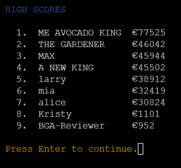
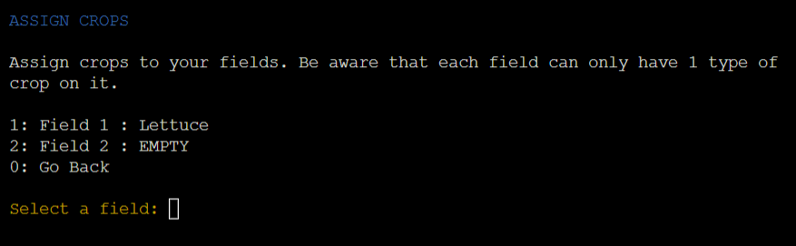

# Veggie Garden

Veggie Garden is a text-based farming simulator. It is played entirely in a terminal by entering a number or yes/no when required.

Just like in real gardening, knowledge can only be acquired by trial and error. Therefore, certain elements in the game are not displayed. Instead, the user has to find out and learn by himself.

## Live Page
[https://veggie-garden.1441990.xyz](https://veggie-garden.1441990.xyz)

## Objective

The objective of this project is to present my skills in Python, Object Oriented Programming, and other standard programming constructs such as flow control, iteration, selection, functions, and data structures.

Another goal is to implement an API in the project.

## Contents

* [Features](#features)
    * [Input](#input)
      * [Number Input](#number-input)
      * [String Input](#string-input)
      * [Confirm Input](#confirm-input)
      * [Press Enter](#press-enter)
    * [Crops](#crops)
    * [Header](#header)
    * [Main Menu](#main-menu)
    * [How To Play](#how-to-play)
    * [High Scores](#high-scores)
    * [New Game](#new-game)
    * [Resume Game](#resume-game)
    * [Game](#game)
      * [Prepare Season](#prepare-season)
      * [Storage](#storage)
      * [Fertiliser](#fertiliser)
      * [Store](#store)
      * [Fields](#fields)
      * [Assign Crops](#assign-crops)
      * [Season](#season)
      * [End of Season](#end-of-season)
      * [End Screen](#end-screen)
      * [Google Sheets](#google-sheets)
    * [Additional Features](#additional-features)
* [Design](#design)
    * [Colors](#colors)
    * [Layout](#layout)
* [Testing](#testing)
    * [Manual Testing](#manual-testing)
    * [Validation](#validation)
    * [Bugs](#bugs)
* [Development process](#development-process)
* [Deployment](#deployment)
* [Credits](#credits)
* [Acknowledgments](#acknowledgments)

## FEATURES

### Input

- The game is text-based and played entirely in a terminal. 
- The only ways to interact with the game are by entering a number, a string, yes or no, or pressing enter.
- Any user input is always validated. 
- If the input is invalid, an error message is shown and the user can try again.
- For a good user experience:
  - the error message is separated from the rest of the text by a red text color.
  - the user is never asked for data the game already has.
  - the user has to confirm any action that cannot be reverted.
  - the user is always able to cancel an action and go back.
  - the user always knows what input is required without adding specific hints.

#### Number Input

- If the game requires either a selection or amount from the user, a number prompt is displayed.
- The input is validated to ensure that a number between a minimum and maximum value is entered.
#### String Input

- If the game requires a string from the user such as a username, a string prompt is displayed.
- The user can enter any character or number but the string length must be between a minimum and maximum value.
#### Confirm Input

- For any action that is not revertable such as spending money, a confirmation prompt is displayed.
- The user has to either enter "yes" or "y" for confirming or "no" or "n" for declining.
#### Press Enter

- Whenever information is displayed that does not require specific input from the user, a "Press Enter" prompt is shown.
- This prompt only requires the user to press the Enter key when they are ready, to continue to the next screen. 

### Crops
- The game offers a variety of crops. They all have different prices, growing times, and harvest rewards. 
- The growing time and rewards are not displayed to the user. The user has to find out how long it takes for a crop to ripen and how much profit it will bring.
- The general rule for a crop is:  
higher price = longer growing time = higher rewards.  
This means that it is always worth investing in more expensive crops.

### Header

- At the top of every page, the user can find a header that shows the name of the game.
- If a game is currently active, the header also displays following important information:
  - Game ID: In case of a fatal error, the user can always see the game ID to resume the game.
  - Username for identification.
  - Money and year: two main factors of the game. They are crucial for the user to make informed decisions when purchasing and organising fields. 

### Main Menu

- The main menu is the starting point for a new or returning user.
- From the menu, the user can start a new game, load an existing game, navigate to the How To Play, or to the High Scores page.

### How To Play

- The How To Play screen explains all the game elements.
- Since the user is supposed to learn certain things through trial and error, the instructions are intentionally kept slightly vague.

### High Scores

- The high score screen shows the ten best games.
- Only games that finished the last season are shown.
- The games are ordered by the amount of money, the user was able to gather in the ten seasons.

### New Game

- If a user wants to play a new game, the user has to enter a username. The username does not have to be unique and can be reused for every new game.
- Afterwards, a new unique game ID is generated, that can be used to resume a game in progress.
- While the game is loading, the storyline of the game is displayed.

### Resume Game

- If a user wants to resume an existing, unfinished game, the user has to enter the game ID.
- If the user enters a valid game ID, the game is loaded and then started.  

### Game
- The game is played over ten seasons.
- At the beginning of every season, the user can prepare for the upcoming season.
- Once a season is started, the user can not go back to the preparation or intervene. 

#### Prepare Season

- The main screen of the game is the "Prepare Season" screen.
- From here, the user can reach every available game element. 

#### Storage

- In the storage, the user can get an overview of the seeds they currently have.

#### Fertiliser

- In the fertiliser menu, the user can see which levels of fertiliser they have unlocked.
- The menu does not show what effect the fertiliser has. The user has to find out how much the new fertiliser helped in the profits after the next season.

#### Store
 
- In the store, the user can buy new seeds for the next season.

#### Fields

- In the fields menu, the user gets an overview of his fields and the crops currently planted on them.
- From here, the user can unlock new fields or plant crops in the unlocked fields.

### Assign Crops

- Assigning a crop to a field is done by first choosing a field from a list of unlocked fields.
- If a field already has a crop planted, the user is warned, that by assigning a new crop, the old crop will be lost.
- The second step is to choose a crop. The user can choose from a list of all crops but can only select a crop with available seeds.

#### Season

- When the user is ready and starts the next season, the user cannot intervene or go to the preparation anymore.
- During a season the game automatically plays 6 months, from April to September.
- In every month, the game tends to every unlocked field:
  - if the field has a ripe crop, the crop is harvested and replanted as long as the user has seeds left over.
  - if the field has a crop that is still growing, the plant is watered and the user is informed that the crop is not ripe.
  - if the field is empty, it is skipped.

#### End of Season

- At the end of a season, crops are not replanted anymore, so the fields are ready for planting in the next season.
- Every season, a random event can happen that causes a reduction or improvement of the seasonal harvest. A description of the event will be printed above the profits.
- The final profit is displayed to the user and then added to his balance.

#### End Screen

- After the tenth season, the game ends. The end screen displays the final balance to the user.

### Google Sheets
  
Example Crop sheet from Google Sheets.
- All the master data in the game is stored in a sheet. On initialisation, the game elements load the relevant data from the sheet.
- The game progress is regularly saved to a sheet. 
- The user can load and resume their game by using the game ID.
- To provide this functionality, I implemented the use of the python libraries "gspread" and "google-auth".

[Link to the Google Sheets](https://docs.google.com/spreadsheets/d/1WxUWrgHylGpwkegU-006VbJFlS2_B2sNl5PbSTdmaKI/edit?usp=sharing)

### Additional Features
Features that could be implemented in the future:
- Add more crops to the game. The game was designed so that new crops can be added with little effort.
- Add the option to shorten or extend the game by allowing the user to choose the number of seasons to play.
- Add the option to see the profit overview of the last season. This would allow the user to review his profits again later for better preparation for the next season.

## Design

### Colors
Only a few basic colors were used to highlight certain elements:
- In the header, the game name and year are printed in green, and the current balance is in cyan.
- The game ID is always printed in orange.
- The header of every page is printed in blue.
- The month of the season is printed in pink.
- Any request for user input is printed in yellow.
For almost every color, the built-in ANSI Escape Code colors were used. Only for the orange and pink an Escape Code with a specific RGB value was used.

### Layout
  
The game has a very simple layout which is used on every screen.
- At the top of the page is a header bar with the name of the game, the game ID, username, current balance, and year.
- Every page has a heading which is displayed in blue and written in uppercase letters to set it apart from the rest of the page.
- Below the heading, most pages display informative text about the page the user is currently on.
- At the bottom of every page the game requests input from the user. If a selection is required from the user, the game displays a numbered list above the prompt.

## Testing

### Manual Testing
- During the development process I adapted three manual testing procedures:
  - After a minor change, I tested any game element affected by this change. 
  - After a major change, I tested all the game elements for their functionality.
  - After every push to Github, I tested all the game elements in the deployed Heroku app.
- While testing a game element, I made sure that:
  - I was able to navigate to the element and back to the starting point.
  - I could unlock or upgrade all objects.
  - all the interaction and functionality worked as intended.
  - all the information displayed was correct.
  - any changes were saved to Google sheets. 
  - no error occurred.
- For all the testing, I used a prepared game from the Google sheet with enough money to allow me to unlock all objects. After the testing, I reset the account in Google sheets to have it ready for the next testing phase.

- When I finished creating my MVP, I shared the game with multiple users to confirm the game's functionality and to get feedback on their experience.

### Validation
  
There were no errors found in any of my python files using the [Python Linter provided by the Code Institute](https://pep8ci.herokuapp.com/).

### Bugs
#### Fixed Bugs
- Buying more levels/fields than available:  
After purchasing all the fertiliser levels or fields, the user was still offered the option to unlock the next. If the user tried, the game threw an exception when it tried to retrieve the price.  
Fixed by hiding the option when all the levels/fields were unlocked.  
- Resuming an already finished game:  
Users were able to resume a game that was already finished by entering the game ID. They could continue the game indefinitely but the game would not show in the High Scores.  
Fixed by only allowing users to resume games with less than 10 years.

#### Unfixed bugs
There are no known unfixed bugs.

## Deployment

The site was deployed using Heroku.

The steps to deploy an app to Heroku are as follows:
- Create a new App from the Heroku dashboard.
- Enter a name for the app and select a region, then click on "Create App". 
- On the page of the app that opens, go to the "Settings" tab.
- In Settings add the config vars "PORT: 8000".
- For the Google API, add another key "creds" with the credentials as the value.
- Next, add the buildpacks "Heroku/Python" and "Heroku/Nodejs" in that specific order.
- Afterwards, go to the "Deploy" tab on the app page. 
- In the "Deployment method" section, select "GitHub" and follow the steps to connect Heroku with GitHub.
- Then, in the "Connect to GitHub" section, search for the repository that is supposed to be deployed and click on "Connect".
- The last step is to either:
  - enable automatic deployment by clicking on the button "Enable Automatic Deploys" in the "Automatic Deploys" Section.
  - deploy a branch manually by selecting the branch and clicking the button "Deploy Branch" in the "Manual deploys" section.

The live link can be found here: [Veggie Garden](https://veggie-garden.1441990.xyz)

### Development process

The first step in my development process was to plan the game as much as possible:
- On a piece of paper, I wrote down all my ideas for game elements, prices, and rewards.
- When I was happy with my idea, I created a flow chart for the game. This chart gives an idea of the structure and displays when user input is required.  
[Link to the flow chart](https://drive.google.com/file/d/1ePNCYjguml90I2_duhkUcEOJxNSdgdUi/view?usp=sharing)
- Next, I created a simple class diagram that shows all the classes I was planning on implementing. Every game element should have a class, which handles all interactions with this game element.  
[Link to the class diagram](https://drive.google.com/file/d/1kA1w2TndrE-gBi_MWywbsUu0iXvsJVjE/view?usp=sharing)
- As the last step in the planning, I thought about the User Interface and its layout. Since it is only a simple terminal application, I omitted wireframes.  
I only decided that every page should have the same layout with a header bar at the top, that displays all the critical information.  

Please be aware, that the flow chart and class diagram are only rough sketches that helped me accelerate the development process. They do not follow conventions and were not updated if I implemented something differently.

- I started the program and repository by using the [gitpod python template](https://github.com/Code-Institute-Org/python-essentials-template) provided by the Code Insitute.
- Then I regularly staged my changes using the command `git add <filename>` and then committed the staged changes to my local repository using `git commit -m 'short descriptive message here'`.
- Finally, I would push the commits from my local repository up to the GitHub repository using the command `git push`.
- With every push, Heroku automatically deploys my latest commit from the 'main' branch to the Heroku app.

## Credits
- I learned how to color text in the terminal with ANSI Escape Codes on [Replit](https://replit.com/talk/learn/ANSI-Escape-Codes-in-Python/22803).
- I created the flow chart and class diagram with [Draw.io](https://draw.io/).

## Acknowledgements

I would like to acknowledge the following people who have helped me along the way in completing my third portfolio project:
- My husband, Moritz Wach, for all his support and advice.
- My mentor, Spencer Barriball, for all his guidance.
- My friends and family for testing the game rigorously.
